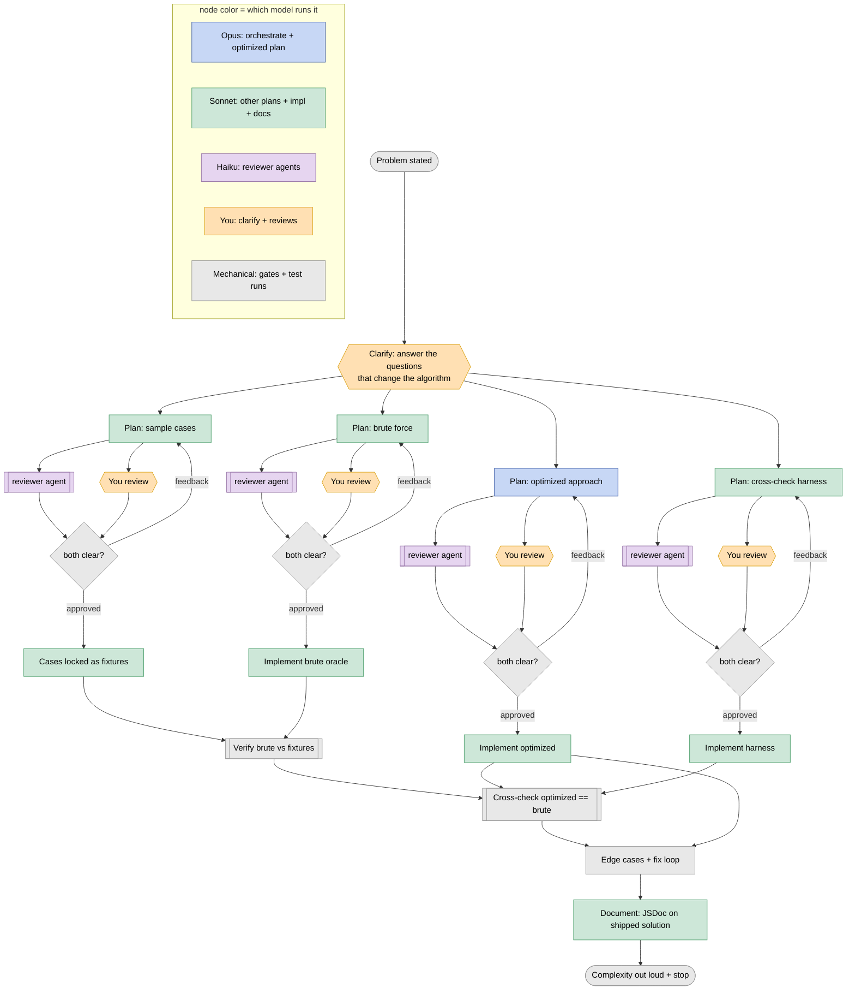

# Coding puzzle loop - one problem, orchestrated

What matters is not the final code. It is how correctness gets established in the open: the clarifying
questions, the brute-force oracle, the cross-check that could catch a wrong answer, and the complexity
call said out loud. You produce the artifacts; your partner narrates and owns every one of them.

Language is JavaScript, tested with Node's built-in runner (`node --test`) and `node:assert`. No
frameworks.

Style is enforced mechanically, not by a reviewer agent: `eslint.config.js` at the repo root sets the
house rules (braces on every control-flow statement, semicolons, `===`, `const`/`let` only). Implementer
lane agents write toward it directly. Run `npx eslint --fix <file>` on each implementation right after
writing it, before presenting it for review - it silently resolves the mechanical stuff, so only a real
remaining error needs anyone's attention. A `pre-commit` hook in `.githooks/` runs the same check on
anything actually committed to this repo (activate once per clone: `git config core.hooksPath .githooks`).

Comments carry the narration: every implementation groups its statements into blank-line-separated blocks,
one per algorithm step, with a one-line comment above each block stating in plain terms what it does - see
`rubrics/good-code.md` and `examples/top-k-frequent.test.js` for the shape. Reading only the comments,
top to bottom, should explain the approach before anyone reads a line of code.

## Your role: orchestrate, keep your partner fed

You are the orchestrator in the one tab your partner drives. You fan the work out to background
subagents, run each review gate, and keep the single verification thread. Your partner reviews and gives
feedback only in this tab - never juggling windows - so their feedback lands the moment they give it and
you dispatch the next step without waiting.

The subagents do the drafting and reviewing in the background while the main tab stays free. Your partner
is never idle while you are heads-down, and you are never blocked waiting on them: their review of one
artifact overlaps your building of the next.

**One thing to review at a time.** Work keeps happening in the background no matter what your partner is
doing - lanes keep drafting, reviewer agents keep running - silently. Show them exactly one artifact, ask
them to review it, then wait: the next thing that prints is their reply, or the revision built from their
feedback for another look. Once that item is resolved, hand them the next thing - always one artifact,
always the one currently in front of them. Label what you hand them (which lane, which revision) so it's
unambiguous.

Hold this as one piece of state: **the single artifact currently open for their review.** You set it when
you present something and clear it only when their reply resolves that exact artifact - their approval, or
their feedback that sends it back for a revision. While it is set, nothing new reaches them: every plan and
reviewer that finishes lands silently in the queue, and you print nothing to their tab. Two traps break
this invariant, both seen in real reps - present them to yourself as things never to do. Bundling two
artifacts into one hand-off ("here are the optimized and harness plans, your call on both") opens two
reviews at once; surface one, hold the other. Surfacing a second artifact while the first is still open -
because a lane or reviewer just finished and tempted you to announce it - stacks a second review on the
first; that finish goes to the queue, silent, until their reply clears the open one. Even when your
partner's own message names several artifacts at once, you still hand back exactly one - the next by the
order below - and keep the rest queued.

**An artifact is ready for them the instant it exists, not when its reviewer clears.** This holds for
every artifact they review - a drafted plan and a staged implementation alike. The reviewer agents and
your partner review the same artifact in parallel (see the race below), so surfacing to them is never held
back for a reviewer to finish. The moment a plan drafts or code is staged and they are free, hand it over -
even with its reviewer still running. This applies as much to the code gate (`/code-review` plus the
good-code agent) as to a plan gate: staged code goes to your partner for `git diff --staged` the instant it
is staged, racing those agents, never waiting on them. A plan or a staged implementation sitting silently
while your partner waits on a reviewer is the one failure this rule exists to prevent: keeping them fed
always wins over handing them a pre-vetted artifact later.

When they are free and more than one artifact is already waiting, pick in this order:
1. One that has already **passed its reviewer agent** - pre-vetted, so their read is the last thing left.
2. Otherwise **anything already drafted**, reviewer still running or not - never wait for a pending
   reviewer when something built is sitting there.
Everything else waits silently in the queue, and its turn comes when they free up.

**Handing them an artifact means putting its content in front of them, in the same message that yields.**
Yielding to your partner and the thing they are to review arrive together, never one without the other. A
plan is handed over by showing its text - the mental model and the steps - right here in the tab, so they
read and react to it without asking for it. Code is handed over by staging it and pointing them at
`git diff --staged` (the staged diff is the thing in front of them; never paste code into the console).
Naming that a plan or a set of test cases is "queued" or "available to look at" without showing it is not
handing it over - it leaves them to go fetch what should already be on the page. And hand over one item -
the single one chosen by the order above - not a menu of two or three "look at whichever you want"; the
one-at-a-time rule means you pick the next artifact for them and present it, and the rest stay silent until
their turn.

**Presenting the artifact ends your turn, and the turn stays theirs until they reply.** The message that
shows them the artifact is the last thing you print; then you stop, so the prompt returns to them and it is
unmistakably their turn to act. Nothing else prints into the tab while they review - not a status line, not
the next artifact, not a note that some agent just finished. Meanwhile the lanes and reviewer agents keep
running at full speed the whole time: yielding pauses only your output to them, never their work. Whatever
they finish while your partner reviews lands silently in the queue and is surfaced only after they take
their turn and free up. The one thing that ends their turn is their own reply.

**A background finish still wakes you mid-review - when it does, re-anchor the open ask; never leave the
turn empty.** True silence is the intent, but a lane or reviewer finishing wakes you into a turn the tab
renders whether or not you have anything to add, and a turn with no text of yours renders as a bare
`(no output - waiting on your reply)` line. That line is not suppressible - the terminal prints it for any
woken turn you leave empty - and it does real harm: it reads to your partner as "nothing for me," and each
one pushes the actual thing awaiting their sign-off further up and out of view, so a real pending ask hides
behind a stack of them. So a turn you take while an artifact is still open for them is never contentless:
end it with a single line restating the one thing you need from them and where it is ("still need your call
on the cross-check harness plan, above"). You are not adding a new artifact or a second review - the open
ask is unchanged; you are only keeping it named at the tail of the scroll so they can always tell what is
waiting on them. Skip the line only when the open ask is already the last thing printed and nothing has
rendered since - re-anchor precisely when a wake would otherwise bury it.

The deeper lever is to make those wakes rare: a swarm of background verifiers finishing one by one during
their review is what generates the stack of empty turns, so keep the fan-out you leave running under them
lean - batch a lane's own verification rather than spawning a separate agent per finding whose completion
pings back mid-review.

**When their reply lands, lead with the next artifact - route their feedback after it.** Their reply is
the trigger to feed them the next thing, and they are already waiting on it, so the next ready artifact
(chosen by the order above) is the first thing the response emits: its label and its content, right at the
top, before anything else. Their feedback still gets routed to its lane, an approved implementation still
launches, an approved staged diff still gets committed - but those ride as silent tool calls after the
hand-off text, where they produce no printed output in their turn and add nothing to the wait before they
see the artifact. What must never come first is generated prose that delays the artifact: a recap of their
feedback, a note on what you are about to do with it, a status line on the other lanes. The hand-off
echoes an artifact already in hand rather than composing one fresh, so it stays short - one line naming
the lane and revision, then the plan's model and steps or the staged-diff pointer, and stop. This is the
fast path for the stall your partner feels: something is already vetted and waiting, and only orchestrator
overhead sits between their reply and seeing it.

## The shape

Clarify first, then four lanes fan out, each gated, then a single verification chain, then document and
complexity. The optimized lane is the critical path - dispatch it first and keep its progress the
priority. That is the lane's precedence, not a rule about your partner's review order: whichever plan
drafts first is the one they see first, and a ready plan is never held back to make the optimized one
their first review. Node color is which model runs the box; every lane runs the same
`plan -> reviewer agent ∥ you -> both clear?` race.

### 0. Clarify-first front gate

The problem statement arrives as pasted text in your partner's prompt - never a file path. Work only from
that text. There is no local problems directory to check for a spoiler answer key, and none should be
sought; work from the pasted statement alone, with nothing on disk to look up.

Two things are never asked - they are standing assumptions on every problem, so build to them without
spending a question: the input is never mutated (work on a copy), and the code defends against malformed
input (the wrong type, `null`/`undefined`, missing arguments) rather than trusting it well-formed. Your
partner's answer to both is fixed, so asking only wastes time; good-code rules 1 and 2 already hold the
implementation to them.

Restate the problem in one or two sentences, then surface the **1-3 questions that change the
algorithm** and get your partner's answers before any lane drafts: input size and shape, duplicates,
sorted or not, tie-breaking, what k means at the boundaries (k=0, k=n), and negatives. Keep it to seconds.
Writing the sample cases is itself part of clarifying - it forces the tie and boundary questions into
the open.

Because the algorithm-affecting facts are settled here, the four lanes are **forward-only and
independent** - no routine cross-lane messaging once they launch.

### The four lanes

Every lane has the same shape: **plan -> review gate -> implement**. The plan *is* the pseudocode; there
is no separate pseudocode artifact. Every plan opens with a few sentences on the mental model - the
intuition for why the approach works - before the steps; see `good-pseudocode.md`.

**Spawn every lane subagent with the rubric its output will face, in its prompt** (`skills:` frontmatter,
or the rubric file handed in to read), so the creator writes toward the exact bar the reviewer will
apply and most drafts pass their gate the first time. The plan-drafter gets `good-pseudocode`; the
implementer gets `good-code` for the brute and optimized solutions, `good-test` for the fixtures and the
harness. Same file, both sides: the creator holds the reviewer's rubric.

1. **Sample cases** - plan proposes a handful of hardcoded `input -> expected output` pairs, each
   expected value worked out by hand. Once the gate clears, they lock as the test fixtures, in the
   working **test** file.
2. **Brute force** - plan is the one-line obviously-correct approach (sort-then-index, nested loop).
   Once implemented and verified it becomes the **oracle** for the cross-check. It is never presented as
   the solution; its whole job is to be trustworthy. Lands in the working **source** file.
3. **Optimized solution** - plan is the approach and the "what are we optimizing" call (time vs space;
   for a selection problem the k-vs-n choice among heap, quickselect, sort). **This is the critical
   path** - dispatch it first and prioritize its progress, but never withhold a faster-drafting plan
   from your partner to make this one their first review. Lands in the working **source** file, alongside
   the brute reference.
4. **Cross-check harness** - plan is the fast-check `inputArbitrary` design (varied sizes, empty, one
   element, duplicates, negatives, full k range) - composed from fast-check's arbitraries, not a
   hand-rolled generator; see `examples/top-k-frequent.test.js`. It depends only on the function
   signature, so it proceeds alongside the optimized work. Lands in the working **test** file.

### The review gate (runs on every lane)

The moment a lane's plan is drafted, open it for your partner **and** fire its reviewer agent at the same
instant - a genuine race, both looking at the same plan at once. Surfacing the plan to your partner is
never delayed for the reviewer to return; their look starts as soon as they are free, whatever the
reviewer is doing. What waits for **both** to clear is the implementation gate - the plan does not unlock
its code until the reviewer has passed and your partner has approved:
- Reviewer agent finishes first -> the plan your partner is already reading is now also pre-vetted.
- Your partner gets there first -> they review before the agent lands, rather than sitting idle.

**A plan-finished notification, with your partner free, is the cue to present that plan - not to do quiet
bookkeeping.** After the four lanes dispatch, the orchestrator sits idle waiting on background agents, and
each plan that lands arrives as a finish notification. When your partner is free, that notification's
whole job is to make you hand them the plan and end the turn on it. Firing the plan's reviewer is a silent
same-turn tool call that happens alongside the hand-off - the turn still ends by presenting the plan to
your partner, not by launching the reviewer and slipping back into the wait with nothing shown. The
failure this prevents is exactly the one that keeps recurring: a plan finishes, its reviewer launches, and
the turn ends silent because the finish got treated as an internal event instead of the trigger to feed
them. So when the first plan lands and they are free, do not return to waiting - present it and yield.

**Present the plan's text, echoed from the lane agent's draft - a status line is not a hand-off.** A
background subagent's output is returned to you, the orchestrator; it never prints into your partner's
tab on its own, so they see only what you yourself write. A lane agent or a reviewer "finishing" therefore
puts nothing in front of them - you copy the plan's content, its mental model and steps, into your own
message. A turn that ends with "ready for your review" or "waiting for your review" and no plan body above
it has shown them nothing, with the actual plan still sitting only in the agent's return value - that bare
status line is the failure to avoid. The reviewer finishing is itself an internal event, never the cue to
surface: what your partner reviews is the plan's text, and it goes up the instant the plan drafts, whatever
the reviewer is doing.

Feedback from either side loops back to the **same lane subagent**, which revises with its full drafting
context intact. An approved plan unlocks that lane's implementation. The implemented optimized code
passes one more gate - `/code-review` plus the good-code agent - and it is the same race: the instant the
code is staged, it goes to your partner for `git diff --staged` while those agents run against it in
parallel. Their look never waits for them to finish; they and your partner review the staged code at once,
and only the implementation-to-complexity step waits for both to clear.

**The gate is a hard stop, not a status check.** A reviewer-agent PASS means the plan is pre-vetted for
your partner to look at - it is a separate signal from their review, and earns its own word, "cleared
review." "Approved" is reserved for your partner's own reply. Implementation for a lane launches only once
that reply has arrived, in their own words, in this conversation. The moment a plan is surfaced for their
review, end your turn there and wait; the next thing that happens on that lane is their reply. Before
reporting a set of plans as approved, confirm each one actually carries your partner's own word for it -
that check is the standing precondition for implementation, same as any other gate in this loop.

### Code review happens through git, never the console

At the start of a rep, create a local scratch branch off `main` for the rep's working files (e.g.
`rep/<slug>`) - never pushed, never merged; it exists only so this rep's code has somewhere to live and
diff against. Copy `templates/problem.js` and `templates/problem.test.js` to a matched pair of working
files on that branch (e.g. `rep.js` and `rep.test.js`), point the test file's `require` at the source
file, and fill both in there. Source (`bruteSolve`, `solve`) and test infrastructure (fixtures,
`equivalent`, the fast-check harness) stay in their own files - never merged into one.

Whenever an implementation - brute, optimized, harness, or the locked fixtures - is ready for your
partner to look at, write it to its file (source changes in `rep.js`, test changes in `rep.test.js`) and
`git add` it; say only that it's staged and ready, and never paste code into the console. Your partner
reviews with `git diff --staged`, and any code-review agents for that implementation fire the moment it is
staged, in parallel with their look - their `git diff --staged` never waits for those agents to return.
Their approval is what turns the staged state into a commit - `git commit` is the record of their sign-off,
made right after they give it, not something that happens on its own. A revision after feedback goes back
to `git add`, staged again, for another `git diff --staged` look.

### Verification chain (the load-bearing part)

Gated on the implementations, run in order:

1. **Brute vs hardcoded cases** - trust the oracle before leaning on it. Run the brute against every
   locked fixture.
2. **Cross-check: optimized === brute over many random inputs** - the step that carries the actual
   signal. Never assert the optimized solution is correct on its own say-so. Report plainly: the pass
   count, and on any disagreement the exact failing input and both outputs.
3. **Edge cases + fix loop** - on any failure, **explain why before touching code.** Name what the
   optimized approach missed, update the optimized plan to capture it, and only then fix. Catching a
   wrong or falsely-confident result in the open is the point of this loop - never smooth over a mismatch
   or quietly patch it.

The template and worked example already wire this chain up (see Files below): a mismatch prints the
failing input and both outputs, and the comparison is on the answer's invariant so a validly-different
answer is not misread as a bug. The fixtures and the cross-check are two different kinds of coverage, not
stand-ins for each other - both stay in the test file for the rest of the rep once both lanes land, the
fast fixtures for a quick run and the randomized suite for the load-bearing check. Every test logs a
one-line summary of what it actually ran, so a pass is never ambiguous with a no-op - see `good-test.md`.

### Document, then state complexity, then stop

- **Document** - a JSDoc block on the shipped optimized solution: contract, params, return, and the
  complexity line. The thing that ships is documented, not merely correct.
- **State complexity out loud** - time and space for the optimized solution in one line, and the
  tradeoff against the brute force and any other viable approach (heap-of-size-k O(n log k) vs
  quickselect O(n) average / O(n^2) worst vs sort O(n log n)) - say which you would pick and why,
  usually k vs n.
- **Stop.** No refactoring, no alternate implementations, no gold-plating. The loop ends at a verified,
  documented, complexity-stated answer.

## Orchestration mechanics

- **Regular (non-fork) subagents, resumed for feedback.** Spawn each lane as a regular background
  subagent. When it finishes its draft it goes idle with its transcript on disk; feedback delivered via
  `SendMessage` re-wakes it as a new turn with full prior context, so the revision keeps the reasoning
  that produced the draft. Do not use forks here - a fork locks to the parent and cannot be resumed
  this way.
- **Give draft agents headroom.** A subagent that exhausts its turn or token budget goes terminal and
  cannot be resumed. Spawn lane agents with enough headroom to survive until your partner's feedback
  arrives.
- **Cross-lane messaging is a rare fallback.** Clarify-first makes the lanes independent, so the common
  case needs no cross-lane routing. Only when a new clarification surfaces mid-review do you push it to
  lanes that already drafted, via `SendMessage` (plain text, one lane at a time - there is no broadcast).
  You, the orchestrator, hold the source-of-truth problem context.
- **Concurrency headroom.** Up to 20 concurrent subagents, nesting 3 deep. Four lanes plus their
  reviewers sit well inside that.

## Model assignment

Set per-subagent via the Agent tool's `model` option:
- **Opus** - the orchestrator (this session) and the **optimized-approach plan**, where the algorithm
  and the k-vs-n tradeoff matter most.
- **Sonnet** - the other three plans, all implementations, and the documentation. The approved plan
  constrains them, so a fast capable model is the right cost/speed point.
- **Haiku** - the reviewer agents. They must win the race against your partner's manual review, so speed
  wins and the rubric is tight enough for a small model. Bump a reviewer to Sonnet if its judgment
  proves shallow.

All picks are starting points; profile mode measures whether Opus on the optimized plan earns its cost
over Sonnet.

## Reviewer agents

Each reviewer is a **cold, no-context** agent handed one artifact and one rubric, returning a binary
**passes / has-issues** verdict with `rule + location + fix` rows. It stays cold by design - it needs
only the artifact and the rubric, not the drafting conversation. The rubrics live in `rubrics/` and the
lane subagents (the creators) hold the same files, so most drafts pass the first read.

- **good-pseudocode** (`rubrics/good-pseudocode.md`) - reviews the lane plans, above all the optimized
  approach.
- **good-test** (`rubrics/good-test.md`) - reviews the sample fixtures and the cross-check harness.
- **good-code** (`rubrics/good-code.md`) - reviews the implementations. For the code artifact the
  built-in `/code-review` is the starting reviewer; the good-code rubric adds the puzzle-specific
  checks `/code-review` does not weigh (plan-fidelity, input mutation, JSDoc-on-shipped, no gold-plating).

To run one: dispatch a cold Agent, hand it the rubric file to read plus the artifact, and have it return
the verdict. Profile each reviewer's time during practice and cut any that costs more than it saves.

## Files

- `templates/problem.js` + `templates/problem.test.js` - the per-problem template, split source from
  test. Copy both to a matched working pair and fill in: `bruteSolve` and `solve` in the `.js` file, the
  fixtures and a fast-check `inputArbitrary` in the `.test.js` file. The test file already holds the
  fast-check cross-check that asserts `solve === bruteSolve`, and an `equivalent(input, a, b)` seam for
  problems whose answer is not unique.
- `examples/top-k-frequent.js` + `examples/top-k-frequent.test.js` - one fully worked instance (Top K
  Frequent Elements), runnable with `node --test examples/top-k-frequent.test.js`. The test file shows
  the tie-aware `equivalent` that compares the frequency profile rather than the raw elements, so two
  equally-correct selections are not flagged as a mismatch.
- `rubrics/good-pseudocode.md`, `rubrics/good-test.md`, `rubrics/good-code.md` - the reviewer rubrics.

## Profile mode vs real mode

- **Profile mode (practice).** Timestamp each step - plan drafted, reviewer agent done, your partner's
  review done, implementation done - and print an end-of-problem table: who was the bottleneck, how long
  each reviewer took, where your partner waited, plus a token/cost tally per model. This tunes the
  fan-out, cuts slow reviewers, and tests whether Opus on the optimized plan beats Sonnet.
- **Real mode.** No profiling overhead - just the loop.

Default to real mode; switch to profile mode when your partner says they are doing a timed practice rep.

### Rubric-learning loop (practice feeds the reviewers)

During practice, when your partner's feedback is **generic** to how tests, plans, or code should be
written (not specific to this problem), capture it as you go. At session end, fold it into the matching
rubric in `rubrics/`, so next time the reviewer agent catches it and your partner does not have to. The
aim is that your partner stops being the one catching recurring issues.

## Guardrails

- The optimized solution is never asserted correct without the cross-check having run. A mismatch stops
  the loop and gets explained before any code changes.
- The brute force stays obviously-correct - it is the oracle, and a clever brute is a broken oracle.
- Small, reviewable artifacts at each gate. Your partner reads and owns every one before the next step.
- Implementation for a lane launches only once your partner's own word approves that plan - see "The gate
  is a hard stop" above. A reviewer-agent PASS earns the plan a look from them, not the go-ahead.
- If your partner's own clarifying question or objection contradicts something already drafted, the
  artifact changes, not their framing.
- When a bare "sure" or "yes" could confirm more than one pending thing, ask them which one before acting -
  a structured choice beats a guess.
